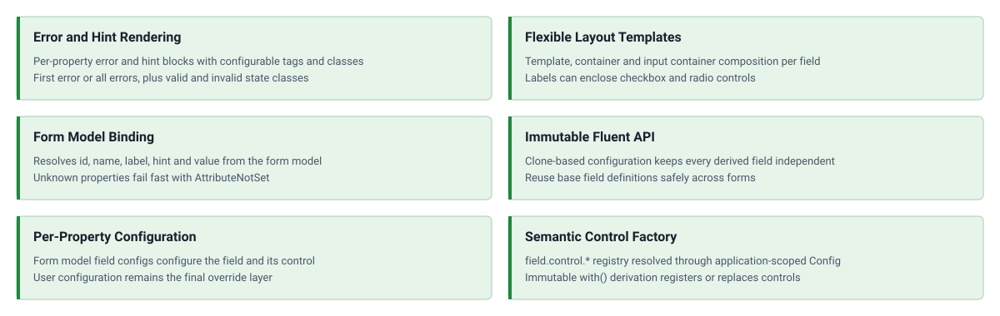

<!-- markdownlint-disable MD041 -->
<p align="center">
    <a href="https://github.com/ui-awesome/html-field" target="_blank">
        
    </a>
    <h1 align="center">Html Field</h1>
    <br>
</p>
<!-- markdownlint-enable MD041 -->

<p align="center">
    <a href="https://github.com/ui-awesome/html-field/actions/workflows/build.yml" target="_blank">
        
    </a>
    <a href="https://dashboard.stryker-mutator.io/reports/github.com/ui-awesome/html-field/main" target="_blank">
        
    </a>
    <a href="https://github.com/ui-awesome/html-field/actions/workflows/static.yml" target="_blank">
        
    </a>
    <a href="https://github.com/ui-awesome/html-field/actions/workflows/security.yml" target="_blank">
        
    </a>
</p>

<p align="center">
    <strong>A fluent, immutable PHP library for rendering form fields bound to a form model.</strong><br>
    <em>Labels, hints, errors, and controls composed through application-scoped configuration.</em>
</p>

## Features

<picture>
    <source media="(max-width: 767px)" srcset="./docs/svgs/features-mobile.svg">
    
</picture>

### Installation

```bash
composer require ui-awesome/html-field:^0.1
```

### Quick start

#### Render a field bound to a form model

The field resolves the `id`, `name`, and `label` from the form model and renders a text input by default.

```php
use App\Model\BasicForm;
use UIAwesome\Html\Field\Field;

echo Field::tag()
    ->formModel(new BasicForm())
    ->property('username')
    ->render();
// <div>
// <label for="basicform-username">Username</label>
// <input id="basicform-username" name="BasicForm[username]" type="text">
// </div>
```

#### Hints and validation errors

Hints link to the input through `aria-describedby`; property errors render after the control.

```php
use App\Model\BasicForm;
use UIAwesome\Html\Field\Field;

$form = new BasicForm();
$form->addError('username', 'Username is required.');

echo Field::tag()
    ->formModel($form)
    ->property('username')
    ->hintContent('Choose a unique username.')
    ->render();
// <div>
// <label for="basicform-username">Username</label>
// <input id="basicform-username" name="BasicForm[username]" type="text" aria-describedby="basicform-username-help">
// <div id="basicform-username-help">
// Choose a unique username.
// </div>
// <div>
// Username is required.
// </div>
// </div>
```

#### Replace the control and style the container

Any form control can replace the default input; the form model field config is applied to the replacement.

```php
use App\Model\BasicForm;
use UIAwesome\Html\Field\Field;
use UIAwesome\Html\Form\InputEmail;

echo Field::tag()
    ->formModel(new BasicForm())
    ->property('username')
    ->input(InputEmail::tag())
    ->containerClass('form-group')
    ->render();
// <div class="form-group">
// <label for="basicform-username">Username</label>
// <input id="basicform-username" name="BasicForm[username]" type="email">
// </div>
```

#### Semantic control factory

`Field` selects controls through `ControlFactory` and applies application-scoped recipes to the field, container,
label, control, hint, error, prefix, and suffix contexts. The package does not select a theme: replace `$theme` with
any `ThemeInterface` implementation, such as a Flowbite or DaisyUI theme.

```php
use UIAwesome\Html\Core\Config\Config;
use UIAwesome\Html\Field\Factory\ControlFactory;
use UIAwesome\Html\Field\Field;

$config = new Config(theme: $theme, factory: new ControlFactory());

echo Field::tag()
    ->config($config)
    ->control('email')
    ->formModel($form)
    ->property('email')
    ->render();
```

The default registry supports `checkbox`, `checkbox-list`, `email`, `password`, `radio`, `radio-list`, `select`,
`text`, and `textarea`. Registrations are immutable — derive a factory with `with()` to replace or extend them.

`Select` and its typed `Option` objects come from `ui-awesome/html`: compose the control there and the field passes
the resolved model value to `Select::value()`.

`CheckboxList`, `RadioList`, and `ChoiceItem` also come from `ui-awesome/html`; `Field` supplies their checked values,
name, validation state, label, hint, and errors. See the usage guide for examples, slot contexts, and recipe methods.

#### Strict field configurations

Form model field configurations are applied through the core config applier in strict mode, once per render, against
the control the field finally resolves — so the fluent call order never changes the outcome. An entry naming a method
the resolved control does not expose throws `ConfigException` instead of being skipped, so typos such as `maxlenght`
fail at render time. The model binding runs first and the config last, so entries such as `value`, `id`, `name`,
`checked`, and `placeholder` act as explicit per-property overrides rather than being silently overwritten. See the
[upgrade guide](UPGRADE.md) for the precedence table and the supported entry shapes.

## Documentation

For detailed usage, testing, and quality workflows.

- [Usage Guide](docs/README.md)
- [Testing Guide](docs/testing.md)

## Package information

[](https://www.php.net/releases/8.3/en.php)
[](https://packagist.org/packages/ui-awesome/html-field)
[](https://packagist.org/packages/ui-awesome/html-field)

## Project status

[](https://codecov.io/github/ui-awesome/html-field)
[](https://github.com/ui-awesome/html-field/actions/workflows/static.yml)
[](https://github.com/ui-awesome/html-field/actions/workflows/quality.yml)
[](https://github.styleci.io/repos/773914929?branch=main)

## Our social networks

[](https://x.com/Terabytesoftw)

## License

[](LICENSE)
